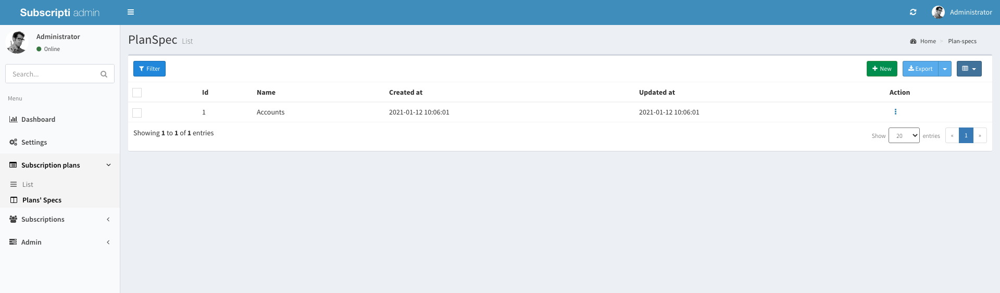
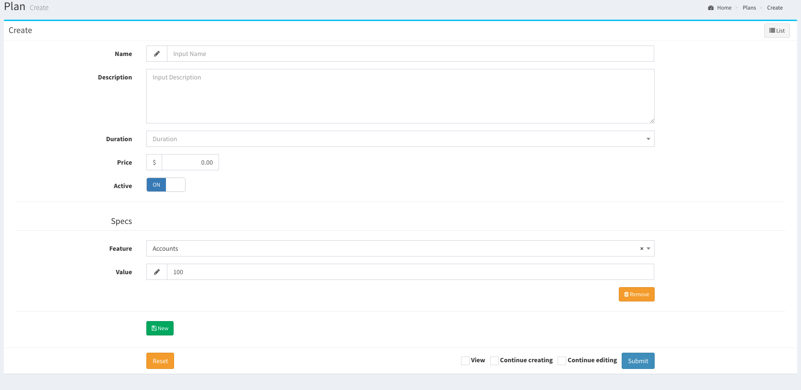

## Plan Management

> Subscribti allows you to manage plan features/specs easily.

## Best practice for creating plans

1. Creating features for plans.
2. Creating your plans.
3. When modifying plans avoid deleting, instead archive your plan by deactivating it and create a new one.

## Adding your system features `(Optional)`

Before you create any plan, you need to add a set of features for examples `maximum number of users`, `number of ads per day` and so on.

- From admin panel click on `Subscription plans` then from the dropdown list click `Plan's Specs` and add whatever specs you like.

## Creating a plan

- From admin panel click on `Subscription plans` then from the dropdown list click `List` and the `new` button on the top can be used to create a new plan.
- To add a feature value for the plan click `new` under the `specs` headline in the plan form.

