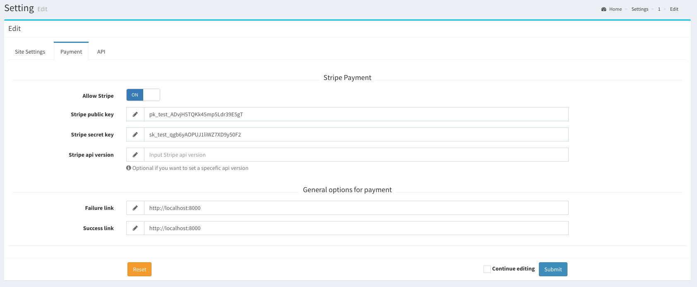

# Settings

> Subscripti allows you to easily manage your website & payment settings through admin panel

to modify your site & payment settings, from the left sidebar click `settings` and add your website and stripe API information that can be found [here](https://dashboard.stripe.com/test/apikeys).

